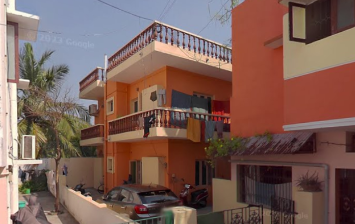
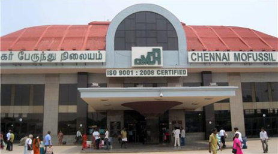
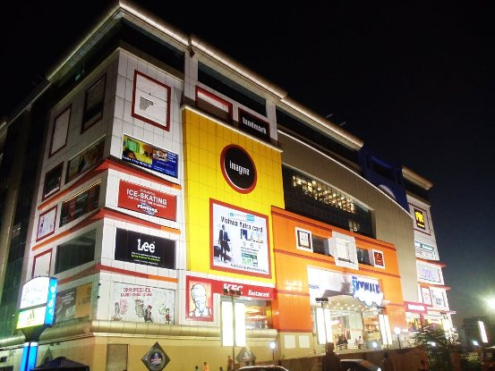

# Ex 06: PLACES AROUND ME USING IMAGEMAP
# AIM:
To develop a website to display details about the places around my house.

# DESIGN STEPS:
## STEP 1:
Create a folder 'static' under the project folder 'myproj'

## STEP 2:
In 'static',create another folder 'html',under which the file 'index.html' should be created.

## STEP 3:
Go to google maps and take a screenshot of your home on it along with some places around it.

## STEP 4:
Go to image-maps.com and make 5 locations on it using the shapes used in maps.

## STEP 5:
Copy the html code for the map and add it to 'index.html'

## step 6:
Create the html documents to be displayed when clicked on the location in the image map.

## STEP 7:
Take screenshots of the output.

## STEP 8:
Push it to 'README.md' and push it to the repository.

# CODE:

# MAP.html
``````
<html>
<head>
<title>My City</title>
</head>
<body>
<h1 align="center">
<font color="red"><b>Arumbakkam</b></font>
</h1>
<h3 align="center">
<font color="blue"><b>Shivraj R(23013397)</b></font> </h3>
<center>

<map name="MyCity">
<area shape="ciclre" coords="1250,250,80" href="home.html" title="home" </map>
<area shape="circle" coords="1250,350,60" href="hospital.html" title="HOSPITAL" </map>
<area shape="circle" coords="1250,250,60" href="mall.html" title="MALL" </map>
<area shape="circle" coords="775,250,60" href="college.html" title="COLLEGE" </map>
<area shape="circle" coords="380,400,60" href="busstand.html" title="BUSSTAND" </map>

</center>
</body>
</html>
``````
### MALL.html
``````
<!DOCTYPE html>
<html>

<head>
    <title>MALL</title>
</head>

<body style="background-color: maroon; color: white; text-align: center;">
    <h1 style="font-size: 100px;"><b>SKYWALK MALL</b></h1>
    <ul style="list-style-type: none; padding: 0;">
        <li style="margin-bottom: 10px;font-size: 25px;">&#9733; In my place is good to visit mall</li>
        <li style="margin-bottom: 10px;font-size: 25px;">&#9733; Malls typically feature a wide range of retail stores,electronics and home goods.</li>
        <li style="margin-bottom: 10px; font-size: 25px;">&#9733; Malls serve as social hubs where people can meet, socialize, and spend time together</li>
    </ul>
</body>

</html>

### hospital.html
`````
<!DOCTYPE html>
<html>

<head>
    <title>HOSPITAL</title>
</head>
<body style="background-color: rgb(64, 128, 0); color: white; text-align: center;">
    <h1 style="font-size: 100px;"><b>HOSPITAL</b></h1>
    <ul style="list-style-type: none; padding: 0;">
        <li style="margin-bottom: 10px;font-size: 25px;">&#9733; Hospitals often have emergency departments that operate 24/7 </li>
        <li style="margin-bottom: 10px;font-size: 25px;">&#9733; Hospitals house various diagnostic facilities, such as laboratories and imaging centers etc.. </li>
        <li style="margin-bottom: 10px; font-size: 25px;">&#9733; Hospitals utilize advanced medical technology, including state-of-the-art equipment and medical devices</li>
    </ul>
</body>
</html>
``````
### COLLEGE.html
``````
<!DOCTYPE html>
<html>

<head>
    <title>COLLEGE</title>
</head>

<body style="background-color: rgb(0, 113, 128); color: white; text-align: center;">
    <h1 style="font-size: 100px;"><b>COLLEGE</b></h1>
    <ul style="list-style-type: none; padding: 0;">
        <li style="margin-bottom: 10px;font-size: 25px;">&#9733; In my place, there is a D.G Vaishnav College of Arts and Science.</li>
        <li style="margin-bottom: 10px;font-size: 25px;">&#9733; This College is very near to my place.</li>
        <li style="margin-bottom: 10px; font-size: 25px;">&#9733; It is good to see the environment in front of my house.</li>
    </ul>
</body>

</html>
``````
## BUSSTAND.html
``````
<!DOCTYPE html>
<html>

<head>
    <title>BUSSTAND</title>
</head>
<body style="background-color: rgb(64, 128, 0); color: white; text-align: center;">
    <h1 style="font-size: 100px;"><b>BUSSTAND</b></h1>
    <ul style="list-style-type: none; padding: 0;">
        <li style="margin-bottom: 10px;font-size: 25px;">&#9733;CMBT is a major bus terminal located in Chennai, Tamil Nadu, India. </li>
        <li style="margin-bottom: 10px;font-size: 25px;">&#9733; CMBT is one of the largest bus terminals in Asia</li>
        <li style="margin-bottom: 10px; font-size: 25px;">&#9733; CMBT facilitates both interstate and intrastate bus services/li>
    </ul>
</body>
</html>
``````
### HOME.html
``````
<!DOCTYPE html>
<html>

<head>
    <title>HOME</title>
</head>

<body style="background-color: maroon; color: white; text-align: center;">
    <h1 style="font-size: 100px;"><b>HOME</b></h1>
    <ul style="list-style-type: none; padding: 0;">
        <li style="margin-bottom: 10px;font-size: 25px;">&#9733; My house is Apartment.</li>
        <li style="margin-bottom: 10px;font-size: 25px;">&#9733; In my home there are five members.</li>
        <li style="margin-bottom: 10px; font-size: 25px;">&#9733; In my home the five people are my father,mother,two sister and me. </li>
    </ul>
</body>
</html>
``````
# OUTPUT:






# RESULT:

The output was verified successfully
